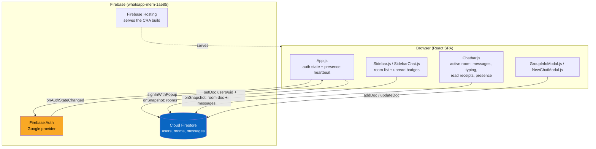
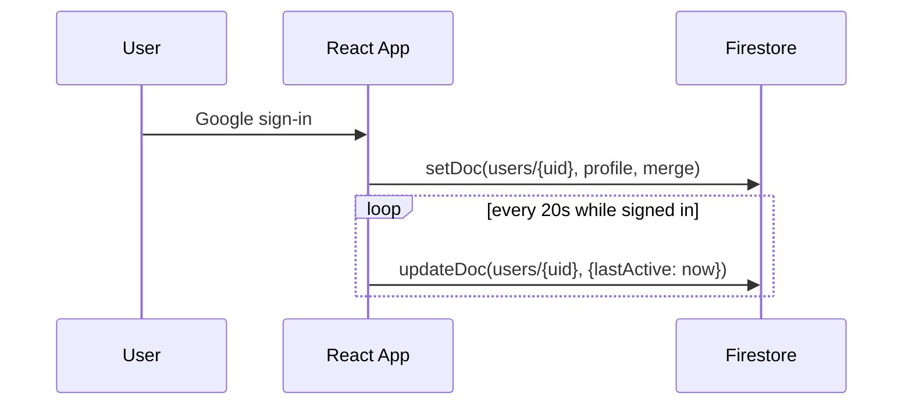
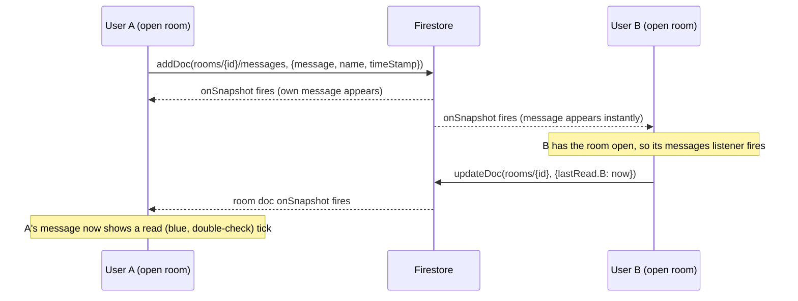

# Architecture: mini-message-app

## Problem Statement

Build a real-time chat app — rooms, live messages, typing indicators, read receipts, and presence — using only client-side code and Firebase. No custom backend, no server to operate. Originally a 2020 learning project for Firebase's realtime data model; the 2026 pass modernized the dependency stack and brought it up to a portfolio-grade feature set (presence, read receipts, unread badges, group info, theming).

## System Overview

There is no application server. The React SPA talks to Firebase directly from the browser: Firebase Auth for identity, Cloud Firestore for all data and its `onSnapshot` listeners for real-time sync, and Firebase Hosting to serve the built static files. The only "backend" logic that exists is Firestore security rules plus whatever the client is willing to write.



## Components

| File | What it does |
|---|---|
| `src/App.js` | Top-level auth listener; writes/merges the `users/{uid}` profile doc on sign-in; runs the presence heartbeat (`lastActive`, every 20s) while a user is signed in; renders `Login` or the `Sidebar` + `Chatbar` shell |
| `src/components/Login.js` | Google sign-in screen (`signInWithPopup`) |
| `src/components/Sidebar.js` | Subscribes to two room queries — `public == true` and `members array-contains <uid>` — merges and de-dupes them into the room list; hosts the theme/log-out menu |
| `src/components/SidebarChat.js` | One room row. Subscribes to that room's own `messages` subcollection to render a last-message preview and compute an unread badge against the room's `lastRead` map |
| `src/components/Chatbar.js` | The open room: message list, send box, image attach, emoji picker, in-chat search, typing indicator, presence label, read-receipt ticks, and the "⋮" menu (chat/group info, clear chat, delete chat) |
| `src/components/GroupInfoModal.js` | Renders `memberNames` as a member list; "Add people" flow pulls from the `users` collection and writes back to `members`/`memberNames` |
| `src/components/NewChatModal.js` | Creates a `direct` or `group` room doc from the signed-in user's contacts (anyone previously seen in the `users` collection) |
| `src/components/InitialsAvatar.js` | Deterministic-color initials avatar (hash of the name → a fixed palette) |
| `src/context/StateProvider.js`, `reducer.js` | Minimal `useReducer` global store — holds only the signed-in Firebase user |
| `src/context/ThemeContext.js` | Light/dark/system theme, persisted to `localStorage`, reacts to `prefers-color-scheme` changes when set to "system" |
| `src/utils/index.js` | `deleteRoom` (batched delete of a room + its messages), avatar color/initials helpers, timestamp formatters |
| `src/config/firebase.js` | Firebase app/Firestore/Auth initialization and config |

## Data Model

Three Firestore locations carry the entire app's state:

```
users/{uid}
  uid, displayName, email, photoURL
  lastActive          // Timestamp, refreshed every 20s while signed in (presence)

rooms/{roomId}
  name, type            // 'direct' | 'group'
  public                // true for the original 2020 demo rooms, false for user-created ones
  members: [uid, ...]
  memberNames: { uid: displayName, ... }
  typing: { uid: displayName, ... }        // present only while that uid is typing
  lastRead: { uid: Timestamp, ... }        // last time uid had this room open

rooms/{roomId}/messages/{messageId}
  name                   // sender's display name, stored as a string
  message, imageUrl?
  timeStamp
```

Messages are keyed by the sender's **display name string**, not their `uid`. This is a deliberate simplification (see Design Decisions #2) — it means a room's conversation can include people who never actually signed in, which is how the app's seed/demo conversations work: `memberNames` carries synthetic keys like `sender:Karan Verma` for participants who are part of the story but have no real account, alongside real `uid` keys for people who do.

## Data Flow





## Key Design Decisions & Tradeoffs

### 1. No custom backend
Firestore security rules are the entire server. This keeps the project deployable as static files on Firebase Hosting, at the cost of pushing all authorization logic into rules rather than code that's easy to unit test.

### 2. Messages keyed by display name, not uid
Storing `name` as a plain string on each message (rather than a `uid` resolved against `memberNames`) means a room's history can include participants who never signed in — essential for the seeded demo conversations. The tradeoff: two real accounts sharing a display name would be indistinguishable in a room's message list.

### 3. Client heartbeat presence instead of Realtime Database `onDisconnect`
`users/{uid}.lastActive` is refreshed every 20s while the tab is open; "online" means a heartbeat landed in the last ~25s. This reuses the Firestore project already in place instead of standing up Realtime Database. The ceiling: a user who closes the tab abruptly still shows "online" for up to ~25s, since Firestore alone can't detect a dropped connection the way RTDB's `onDisconnect` can. (The project's `databaseURL` is already provisioned, so this is a live upgrade path, not a hypothetical one.)

### 4. A `lastRead` map per room, not per-message read state
Read receipts are computed by comparing each other member's `lastRead.{uid}` timestamp against a message's `timeStamp`, rather than writing a "read by" field onto every message. One small map update per room-open covers the whole room's history, regardless of message count.

### 5. Sidebar subscribes to every visible room's full message history
`SidebarChat` opens an `onSnapshot` on `rooms/{id}/messages` per row, just to show a one-line preview and compute an unread count. Simple and correct, but it does not scale — see Scale Considerations.

### 6. MUI for every dialog and menu
`Dialog`, `Menu`, and `List` from MUI handle focus trapping, escape-to-close, and backdrop clicks for free, in exchange for pulling in a full component library for what is otherwise a small, mostly-custom-CSS app.

### 7. Deleting a room deletes it for everyone
There's no per-user archive/hide state — `deleteRoom` batch-deletes the room doc and all its messages outright. Simplest correct model for a project with no concept of "leaving" a conversation.

### 8. Theme is resolved client-side only
Theme choice lives in `localStorage`, not a Firestore user-settings doc, so it doesn't follow a user across devices. Avoided for the same reason as #1 — one more piece of server-shaped state for a project that otherwise has none.

## Failure Modes

- **Best-effort writes are swallowed.** Typing indicators, presence heartbeats, and `lastRead` updates all use `.catch(() => {})` — a failed write just means slightly stale UX (a typing dot that doesn't clear, a tick that doesn't turn blue), never a broken chat.
- **A room-doc snapshot can fire with `undefined` data.** Observed directly during heavy rapid-navigation testing in this project: `onSnapshot` occasionally delivers a snapshot with no data (a transient cache/server race) before the real one arrives. `Chatbar.js`'s room listener now guards this (`if (!data) return`) after it was found to crash the view.
- **No redirect-away on room deletion.** If a room is deleted while another tab has it open, that tab's listeners simply stop receiving updates — there's no explicit "this chat was deleted" state shown to the viewer.
- **Sign-in popup failures surface as a raw `alert(error.message)`** — no retry affordance, no distinction between "user closed the popup" and an actual auth error.

## Scale Considerations

This is a learning/portfolio project, not a system built for load — the design choices reflect that:

- The sidebar keeps one live `onSnapshot` per visible room on that room's **entire** messages subcollection, just to render a preview and an unread count. Fine for ~10 rooms; expensive well before ~100, both in listener count and in bytes transferred per room open.
- Chatbar loads a room's full message history on open with no pagination — a room with thousands of messages would load (and re-render) all of them at once.
- Firestore's automatic single-field indexes cover the two room queries (`public == true`, `members array-contains uid`); no composite indexes are needed at this scale.
- Security rules aren't checked into this repo, so there's no way to review or test the actual server-side authorization boundary from the codebase alone.

## What's Broken / Next Steps

- No message editing — messages can be sent and deleted, but not edited in place.
- Presence is heartbeat-based rather than a true `onDisconnect` signal (see Decision #3); migrating to Realtime Database would close this gap since it's already provisioned for this project.
- No message pagination — will degrade in any room with a large history.
- No production Firestore security rules in the repo to audit.
- The sidebar's per-room message subscription for previews should be replaced with a denormalized `lastMessage`/`lastMessageAt` field written on the room doc at send time, so previews and unread state don't require loading each room's full message history.
