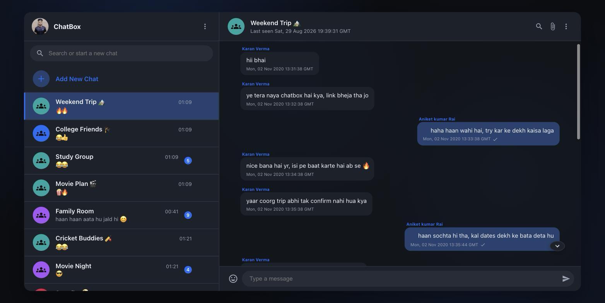
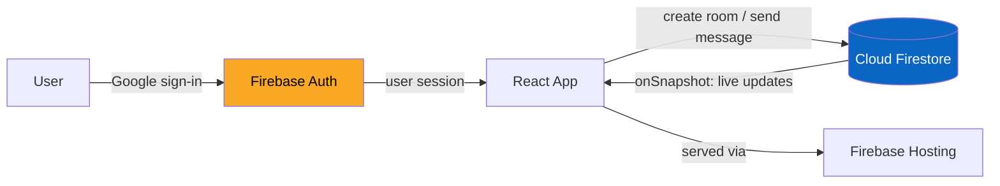
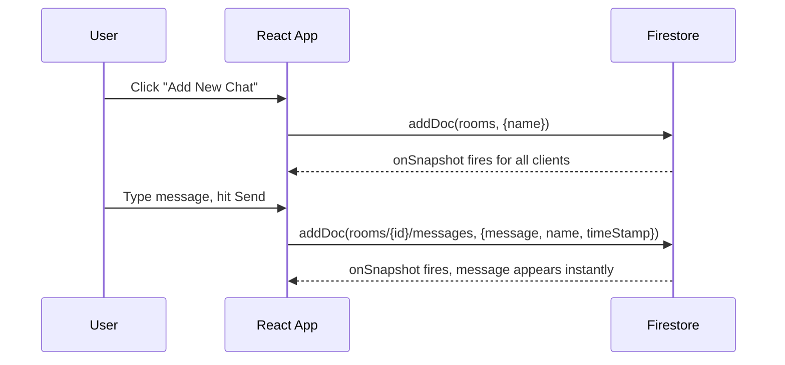

# mini-message-app

A real-time, WhatsApp-style chat UI built with React and Firebase — Google sign-in, live message sync via Firestore, multiple chat rooms, typing indicators, read receipts, online presence, unread badges, and an emoji picker. Originally built in 2020 as a way to learn Firebase's realtime data model; revived and modernized in 2026.



## How it works



There's no custom backend — Firestore's `onSnapshot` listeners push new rooms and messages to every connected client directly, so the "server" logic is just security rules plus whatever the client writes.



## Stack

- **React 18** + **React Router v6**
- **Firebase v11** (modular SDK) — Auth (Google provider) + Cloud Firestore
- **MUI v9** (`@mui/material`, `@mui/icons-material`) for icons and layout primitives
- **emoji-picker-react v4**
- Bootstrapped with Create React App (`react-scripts`)

## Project structure

```
src/
  firebase.js       Firebase app/auth/firestore initialization
  StateProvider.js  Small useReducer-based global store (holds the signed-in user)
  reducer.js        Reducer + action types for StateProvider
  App.js            Top-level router: Login screen if signed out, Sidebar + Chatbar if signed in
  Login.js          Google sign-in screen
  Sidebar.js        Room list, subscribes to the `rooms` collection
  SidebarChat.js     One room row; also doubles as the "Add New Chat" row
  Chatbar.js        Active room: message list, send box, emoji picker
```

## Running locally

```bash
npm install
npm start        # http://localhost:3000
```

Google sign-in will only work from an origin that's been authorized in this project's Firebase Auth settings and Google Cloud OAuth client (`whatsapp-mern-1ae85.web.app`, `whatsapp-mern-1ae85.firebaseapp.com` are authorized today). To run this against your own Firebase project instead of the original demo one, swap the config in `src/firebase.js` for your own project's config and add your own dev origin to its OAuth client.

## Known limitations

- "Add New Chat" uses the browser's native `prompt()` for the room name rather than a custom modal.
- No message editing — messages can be sent and deleted, but not edited in place.
- Online presence is a client heartbeat (`users/{uid}.lastActive`, refreshed every 20s) rather than a true `onDisconnect` signal, so a user who closes the tab abruptly shows "online" for up to ~25s before falling back to "last seen". A real disconnect signal would need Firebase Realtime Database.
- `react-scripts` (Create React App) is no longer actively maintained upstream; it still builds and runs fine here, but a future pass could migrate to Vite.

## History

Built in 2020 while learning Firebase; the original Google OAuth client for the project had since been deleted (a side effect of a 5-year-dormant Google Cloud project) and the dependencies were multiple major versions behind. Both were fixed as part of a 2026 pass that also moved the codebase onto the modular Firebase SDK, MUI v9, and React Router v6.
